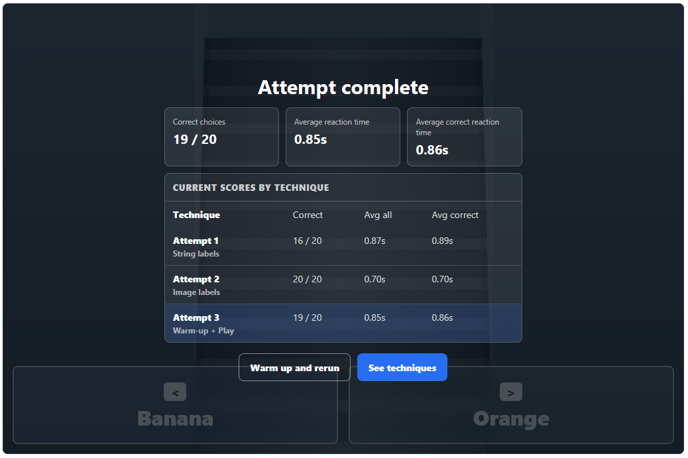
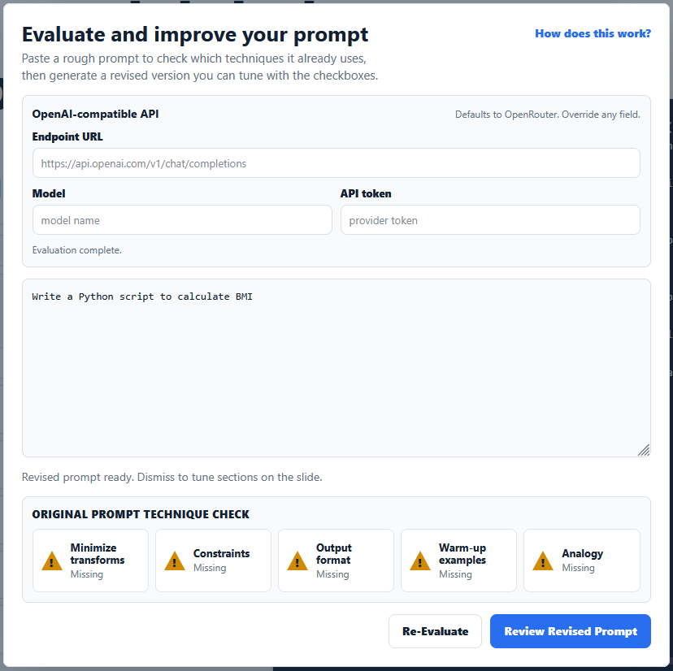
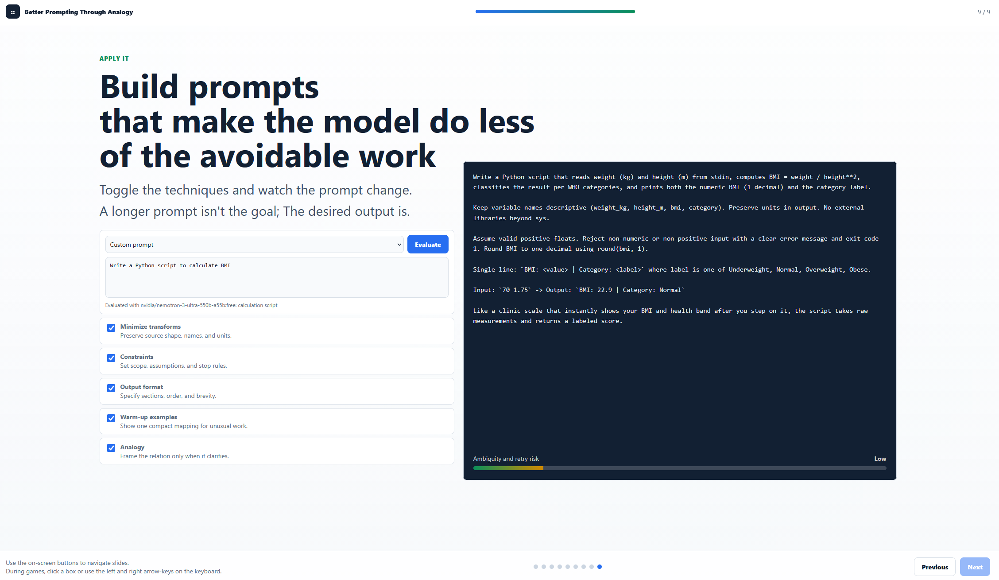

# Better Prompting LLMs Using Analogies

Learn practical LLM prompting techniques through mini-games, and live prompt building.

**Live demo:** https://thecodeartist.github.io/better-prompting-llms-using-analogies/





---

## What it covers

1. **Why prompts matter** — accuracy, speed, token efficiency, and cost
2. **The prompting model** — how a model maps input → pattern → output
3. **Attempt 1: image in, string labels out** — baseline fruit-sorting game
4. **Attempt 2: image in, image labels out** — same task, reduced conversion cost
5. **Attempt 3: string labels with warm-up** — few-shot pre-training effect
6. **What changed** — side-by-side comparison of the three approaches
7. **Techniques** — minimize transforms, warm-up examples, analogies; interactive scratch-card analogy reveal
8. **Embedding analogy** — animated vector-space visualization of `boy → girl + king = queen`
9. **Prompt recipe** — live prompt builder with toggleable technique checkboxes and an optional OpenAI-compatible evaluator

## Core ideas

| Technique | What it does |
|---|---|
| Minimize transforms | Ask in the representation closest to what the model already has |
| Few-shot warm-up | Examples preload a mapping better than abstract rules |
| Analogies | Give the model a direction (a relation to reuse) rather than just a target |

## Running locally

The entire app is a single `index.html` file with no build step and no dependencies.

```bash
# Any static server works, e.g.:
npx serve .
# or
python -m http.server 8080
```

Then open `http://localhost:8080`.

## Prompt evaluator (optional)

Slide 9 includes a prompt evaluator that calls any OpenAI-compatible chat endpoint. Supply your own endpoint URL, model name, and API token — no credentials are stored in this repository.

## Deployment

Pushes to `main` automatically deploy to GitHub Pages via the workflow in `.github/workflows/pages.yml`.

To enable it in a new fork:
1. Go to **Settings → Pages**
2. Set **Source** to **GitHub Actions**

## License

MIT
